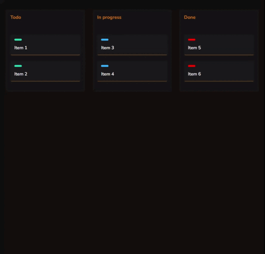

# Projetos em Javascript

## Objetivo

Repositório feito para praticar javascript puro com várias ideias de projetos de nível iniciante.

    <a href="#computer-To-do-list">To-do</a>&nbsp;&nbsp;&nbsp;|&nbsp;&nbsp;&nbsp;
    <a href="#">em desenvolvimento</a>&nbsp;&nbsp;&nbsp;|&nbsp;&nbsp;&nbsp;

## :computer: To-do-list

### Sobre

Aplicação feita em javascript que utiliza o **localStorage** para guardar as tarefas inseridas.

[Código da aplicação](href="./1-todo-list/")

<h1 align="center">
	
</h1>

## :computer: Simple Kanban Board

### Sobre

Aplicação desenvolvida com HTML, CSS e Javascript para treinamento e utilização do drag and drop.

[Código da aplicação](href="./2-simple-kanban-board/")

<h1 align="center">
	
</h1>
